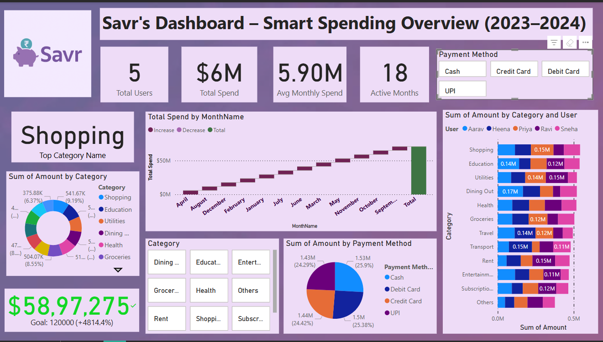

# Savr Dashboard – Smart Spending Overview (2023–2024)
Real time dashboard for Savr Finance Application

## 🔍 Overview
This Power BI dashboard provides a comprehensive visualization of user spending habits using **Savr**, a smart budgeting and expense management application. It covers key financial metrics including:

- Total Spend and Monthly Trends
- Top Spending Categories (e.g., Shopping, Education, Dining Out)
- User-wise and Category-wise Breakdown
- Payment Method Distribution
- Dynamic Filters for Category & Payment Method

---

## 📊 Key Insights
- **Total Spend:** $6M
- **Avg. Monthly Spend:** $5.90M
- **Top Category:** Shopping
- **Goal Achieved:** $58.9M (4814.4% of the target)

---

## 💡 Features
- Interactive slicers for Payment Method and Categories
- Donut and Bar Charts for spend visualization
- KPI cards and goal tracking
- Time-series spend trend analysis

---

## 🛠 Built With
- Microsoft Power BI
- Sample/mock data
- Custom DAX measures
- Visualization techniques for performance insights

---

## 📁 Files contains
- `Savr_dashboard.pbix` – Power BI project file
- `Savr_dashboard.png` – Dashboard screenshot
- `Transactional_Budget_Tracker_dataset_5users`- Sample mock data it can be for more than 1000 users too but this one is only for 5 users

---

## 🧠 Use Cases
- Financial reporting
- Smart budgeting analysis
- Expense behavior insights for fintech apps
- Dashboard prototyping for data analyst portfolios

---

## 🚀 How to Use
1. Download the `.pbix` file
2. Open it with Power BI Desktop
3. Replace or load your own dataset if needed
4. Interact with filters and visuals

---

🧮 DAX Measures Used
This dashboard uses several custom DAX measures to power KPI cards, dynamic visuals, and performance metrics. Below are the key ones used, along with their purpose.

1. Total Spend	Total Spend = SUM(Transactions[Amount])	Benefit: Calculates the total money spent across all users and months.
2. Average Monthly Spend	Avg Monthly Spend = AVERAGEX(VALUES(Transactions[MonthName]), [Total Spend])	Benefit: Computes the average spend across all active months.
3. Active Months	Active Months = DISTINCTCOUNT(Transactions[MonthName])	Benefit: Displays the number of unique months with spend data.
4. Goal Achievement	Goal = 120000
Achieved % = DIVIDE([Total Spend], [Goal])	Benefit: Tracks how much of the financial goal has been achieved.
5. Top Category Name	Top Category Name = CALCULATE(SELECTEDVALUE(Category[Category]), TOPN(1, VALUES(Category[Category]), [Total Spend], DESC))	Benefit: Dynamically returns the top spending category.
6. Spend by Payment Method	Spend by Method = CALCULATE([Total Spend], ALLSELECTED(Transactions[PaymentMethod]))	Benefit: Filters total spend based on selected payment method slicer.
7. User-wise Spend per Category	User Spend = CALCULATE(SUM(Transactions[Amount]), ALLEXCEPT(Transactions, Transactions[User], Transactions[Category]))	Benefit: Used in bar chart to break down spending per user and category.

💡 Usefullness of  These DAX Measures?
-Custom Logic: Tailor metrics like monthly averages, goal tracking, and category-wise spending.
-Dynamic Interactions: Enable slicers (e.g., payment method) to affect visual output in real time.
-User Insights: Understand who spends the most and where (user-category breakdown).
-Goal Tracking: Helps measure savings/spending performance against benchmarks.

---

## 📌 Author
**Heena Shaikh**  
📬 https://www.linkedin.com/in/heena-shaikh-0b96a724b?utm_source=share&utm_campaign=share_via&utm_content=profile&utm_medium=android_app
E-mail: heenashaikh200410@gmail.com 
---

## Ownership
I have brainstorm the idea for the problem & solution requirements and generated mock data for this , this dashboard can be applied to real-world fintech application so this dashboard is created by me entirely.

